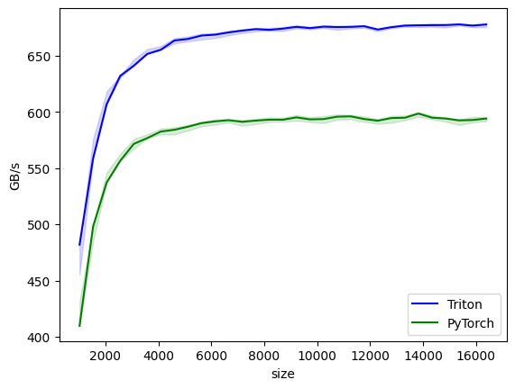
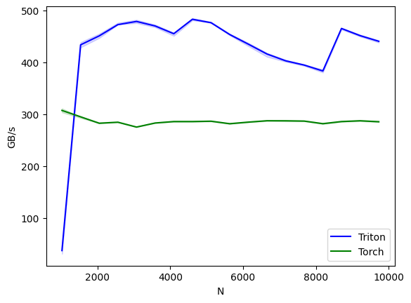

# triton-fused-ops

Benchmark results are provided in the Jupyter notebooks alongside the kernel implementations.

| Dropout Benchmark                | LayerNorm Benchmark               |
|:--------------------------------:|:---------------------------------:|
|       |    |

The idea of optimizing these kernels is to perform as many operations on chip as possible, minimizing the need to write intermediate results back to DRAM.

For random dropout, we use `tl.rand`, which uses the Philox RNG to generate a random number for each thread on the fly, without the need of reading in a random mask from DRAM.

For layer normalization, in the forward pass, the calculations for mean and variance are performed on-chip. For the backward pass (see the math shown [here](#layernorm-bwd-formula-derivation)), we divide the computation into two stages. In the first stage, we compute `DX`, `DW`, and `DB` for each row. Since `DW` and `DB` need to be accumulated across the batch, we first reduce them into `GROUP_SIZE_M` partial sums (using spinlocks, and they all should be retained in L1/L2 cache). In the second stage, we further reduce these partial sums. This approach is faster because the reduction is performed on registers (warp reduce).

`GROUP_SIZE_M` is a key knob. If it is too small, it would lead to too many partials and thus more work for stage 2. If it is too big, there would be more contention and higher L2 pressure

## LayerNorm Bwd Formula Derivation

LayerNorm is calculated for vectors, broadcasted on batches. For each vector, it is

$y_i = w_i \hat x_i + b_i$, where $\hat x_i$ is the normalized input.

For back prop, recall

$$
\hat{x}_a = \frac{x_a - \mu}{\sigma}
$$

with

$$
\mu = \frac{1}{N} \sum_{j=1}^N x_j, \quad \sigma = \sqrt{\frac{1}{N} \sum_{j=1}^N (x_j - \mu)^2 + \epsilon}
$$

and

$$
\dfrac{\partial \sigma}{\partial x_i} = \dfrac{1}{N\sigma}\sum_j (x_j-\mu)\left(\delta_{ij}-\dfrac{1}{N}\right) = \dfrac{x_i-\mu}{N\sigma}
$$

therefore, for each input vector,

$$
\begin{align*}
\dfrac{\partial L}{\partial x_i} &= \sum_{a, b}\dfrac{\partial L}{\partial y_a}\dfrac{\partial y_a}{\partial\hat x_b}\dfrac{\partial\hat x_b}{\partial x_i}\\
&= \sum_{a}\dfrac{\partial L}{\partial y_a}w_a\dfrac{\partial\hat x_a}{\partial x_i}\\
&= \sum_{a}\dfrac{\partial L}{\partial y_a}w_a\left(\dfrac{1}{\sigma}\left(\delta_{a,i}-\dfrac{1}{N}-\dfrac{\hat x_a\hat x_i}{N}\right)\right)\\
&=\dfrac{1}{\sigma}\left(\dfrac{\partial L}{\partial y_i}w_i-\dfrac{1}{N}\sum_aw_a\dfrac{\partial L}{\partial y_a}-\dfrac{1}{N}\sum_aw_a\dfrac{\partial L}{\partial y_a}\hat x_a\hat x_i\right)
\end{align*}
$$

notice there are values that can be shared, if we let

$$
c_0 = \dfrac{1}{N}\sum_aw_a\dfrac{\partial L}{\partial y_a},\quad c_1 = \dfrac{1}{N}\sum_aw_a\dfrac{\partial L}{\partial y_a}\hat x_a
$$

then

$$
\dfrac{\partial L}{\partial x} = \dfrac{1}{\sigma}\left(\dfrac{\partial L}{\partial y}\odot w - c_0 - c_1\odot\hat x\right)
$$

where $\odot$ is element-wise multiplication.

Gradients for learnable weights and biases are easy to calculate:

$$
\dfrac{\partial L}{\partial w_i} = \sum_a\dfrac{\partial L}{\partial y_a}\dfrac{\partial y_a}{\partial w_i} = \dfrac{\partial L}{\partial y_i}\hat x_i
$$

$$
\dfrac{\partial L}{\partial b_i} = \sum_a\dfrac{\partial L}{\partial y_a}\dfrac{\partial y_a}{\partial b_i} = \dfrac{\partial L}{\partial y_i}
$$